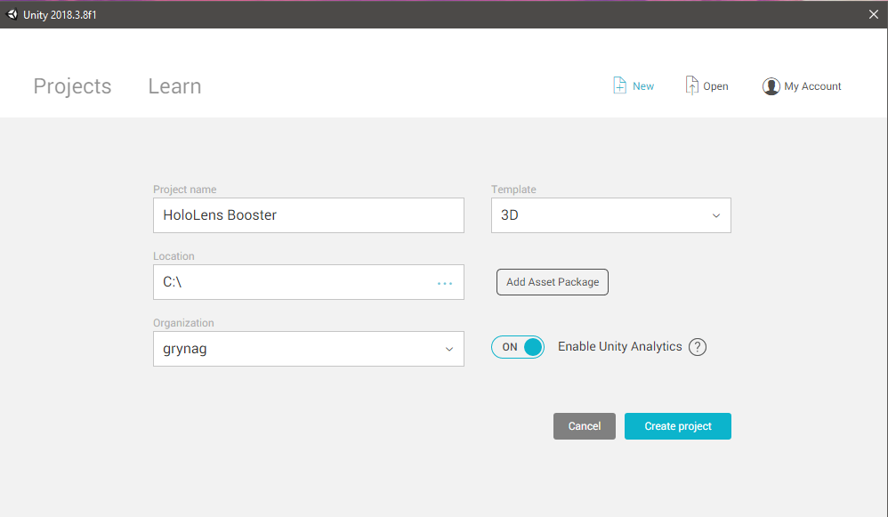
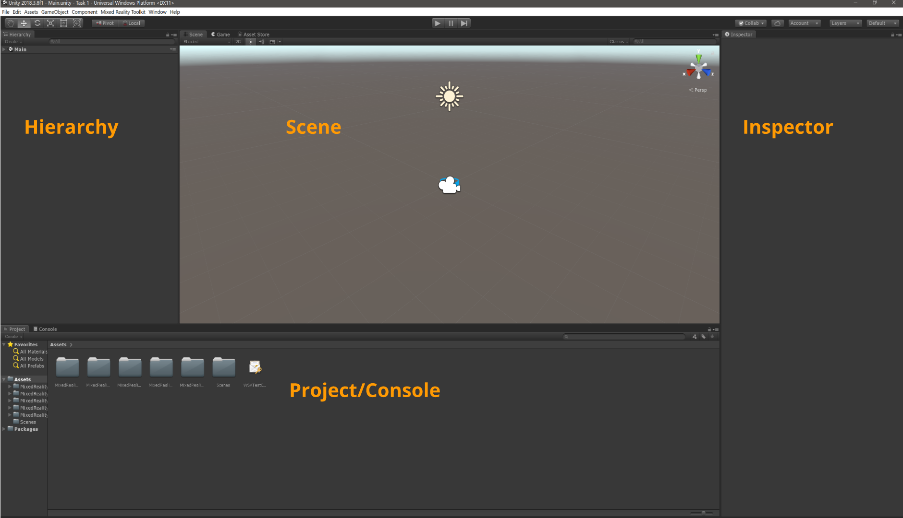
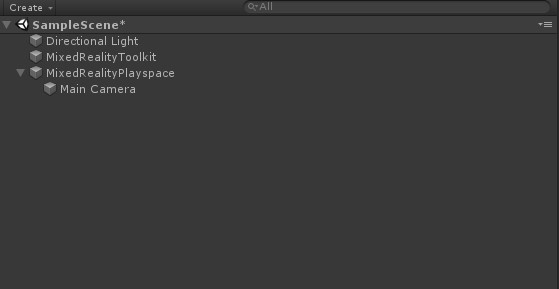
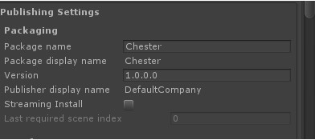
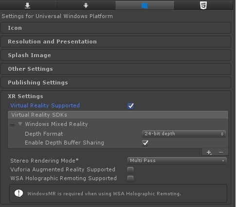

# 1 - Getting started

[📺 Slides](https://grynag.github.io/MixedRealityDevelopment/1-Getting-started/Slides.html#1)

## Create a new unity project
:pencil2:  Open Unity, enter a name and a location for your new project. Make sure 3D is selected as template and click **Create project**.

If you are using the default Unity layout it would look something like this: 

Note the panel names. They will be used throughout the tasks. 

## Import the Mixed reality toolkit
Go to **Assets -> Import package -> Custom package** in the toolbar. Import the Microsoft.MixedReality.Toolkit.Unity.Foundation-v2.0.0-RC1.unitypackage downloaded from https://github.com/Microsoft/MixedRealityToolkit-Unity/releases/tag/v2.0.0-RC1.

Make sure all assets are checked and click **Import**.

Click **Apply** when you are prompted. 

## Setup the project with Mixed Reality defaults
The Mixed Reality Toolkit assets will give you a new option in the toolbar. Go to **Mixed Reality Toolkit -> Add to scene and configure...**. 

New entities will appear in your Hierarchy view: 

:information_source: The **Directional Light** is not needed for the HoloLens as it does not use lights. But you can keep it there if you want to. The **MixedRealityToolkit** is the configurations. The **MixedRealityPlayspace** contains the camera configurations, event system and Gaze provider.

## Save the scene
After the settings are taken care of let's save our scene. We do so by going to **File -> Build settings** and selecting **Save as**. Save the scene inside the scenes folder. Call it `UnityIntroduction`

## Check the settings

Click on the **MixedRealityToolkit** in the Hierarchy. The toolkit options will appear in the Inspector. Click on **Copy & customize**.

*Experience settings:*  
We’ll set this to world as we can take advantage of the spatial mapping capabilities of the HoloLens.

*Camera settings:*  
Double click on the DefaultMixedRealityCamera. You can check the Is Camera Persist if you want the camera to stay the same across scenes. 

As you can see the Opaque Display Settings is set to Skybox and Ultra quality. This setting is for VR headsets.

The Transparent display settings is set to solid color and black, that way the background will be transparent in the HoloLens. As for quality the hardware in the HoloLens limits the graphics settings so keep it on Very low.

As the HoloLens has a transparent display, we don’t have to worry about the *Boundary System settings* so leave that unchecked. 

The same goes for the *Teleport System Settings*. 

The *Spatial Awareness System Settings* enables the spatial mapping on the HoloLens which allows us to interact with the real world in our application. Check this box. 

*Diagnostics* might be useful when testing our application, so leave that checked. 

## Set Unity build settings
Go to **File -> Build settings**, double click on Universal Windows Platform and click on Switch platform. 

Next we need take care of some of the project settings in Unity. Go to **File -> Build settings** and click **Add open scenes**. This will make sure our scene is included when we build the application later. 

## The last few settings
A couple of settings in the Unity settings is also needed. Go to **Edit -> Project settings -> Player**. 

Under **Publishing** settings change the package name. This is the unique name for your application that the HoloLens uses. If you don’t change it and load two different applications they will overwrite each other. 

Next we need to make sure that the Virtual Reality supported checkbox is checked under **XR Settings**. This makes the application run as a VR application in the HoloLens. 

That's it for the project settings, we are ready to create an application: 

[2 Unity introduction](../2-Unity-Introduction/TASK1.md) :arrow_forward:

