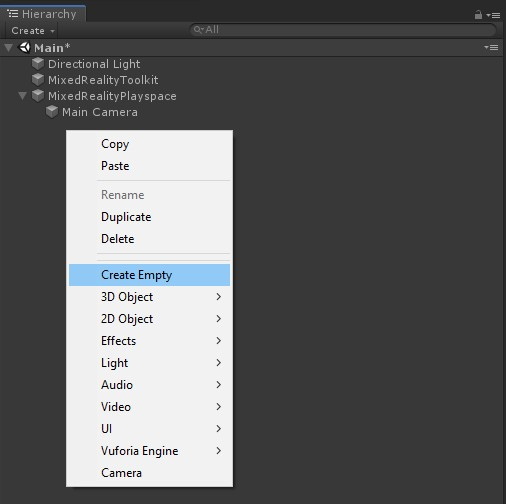
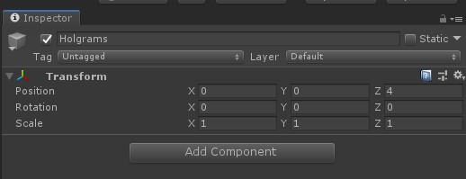
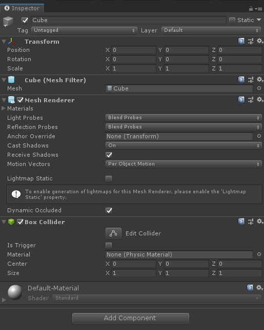
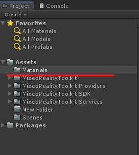
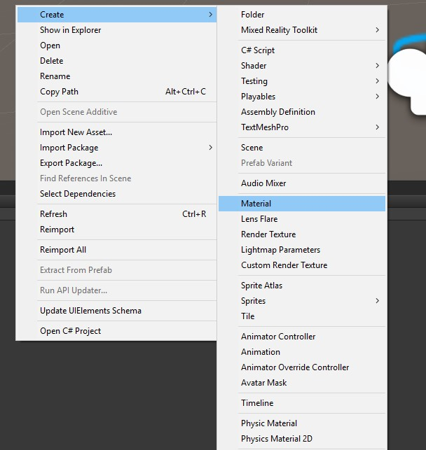
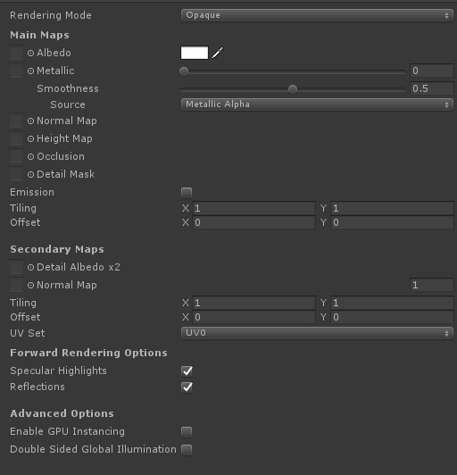
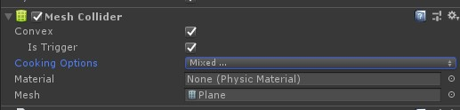

# Unity introduction

[📺 Slides](https://grynag.github.io/MixedRealityDevelopment/2-Unity-Introduction/Slides.html#1)

## ✏️ Create a parent object
Right click in the Hierarchy pane and select create empty. Call it  ```Playspace```.  


We will add our other Holograms inside this GameObject. 

Set the transform of the parent as you see in the screenshot:    


❗️ Child objects inherit the transform of the parent.

❗️ The position set in meters (4 meters). The reason for setting 4 meters is so that the object spawns in 4 meters in front of the camera in the HoloLens.

## ✏️ Create a child object
Add a cube underneath the Holograms GameObject by using the same method as we did in the previous task. 

By default the cube has a Mesh Renderer, a Box Collider and a Default Material.   


## ✏️ Add a material
Create a new folder in the Project pane called `Materials`:  


Click on the materials folder and then right click inside the right window and select **Create -> Material** and give it a name. 



Click on the material and the materials properties will be displayed in the Inspector pane. 



Click on the white square and select a color of your choice. 

Drag the material onto the cube we created earlier in the scene view. 

## ✏️ Creating our first script
Create a new folder called `Scripts`.

Inside it add a script `called MoveCube`. 

Double click on the MoveCube-script and make sure it opens in VisualStudio. 

We first create a public float: 
```C#
public float fallHeight;
```
❗️ The fall height will be available in the Inspector pane of the GameObject using the script

Nex will change the y position of the GameObject on start:

```C#
void Start()
{
    transform.position = new Vector3(transform.position.x, transform.position.y + fallHeight, transform.position.z); 
}
```

The entire script should look like this: 
```C#
using System.Collections;
using System.Collections.Generic;
using UnityEngine;

public class MoveCube : MonoBehaviour
{

    public float fallHeight;

    // Start is called before the first frame update
    void Start()
    {
        transform.position = new Vector3(transform.position.x, transform.position.y + fallHeight, transform.position.z); 
    }

}
```

Go back to Unity and drag the MoveCube script to the cube. 

❗️ When switching between VisualStudio and Unity, Unity compiles the scripts so we need to wait until the spinner in the bottom right corner disappears before we can make changes. 

Set a value in the Fall Height input field by clicking on the cube and add a number in the Inspector pane. Press play to see that the cube spawns at the right position.

Next lets add a Rigidbody to the cube. We do that by making sure our cube is selected, clicking `Add component` and searching for Rigidbody. 

❗️ Use Rigidbody and not Rigidbody 2D as we are working in a 3D-space.

ℹ️ Rigidbody makes the object be affected by gravity.

Now we can make the cube reusable as a prefab. Create a new folder called `Prefabs` and drag the cube into it. Then add the prefab to the scene so that you have two cube. Place them side by side, and give them different fallHeight values.

Press play again and see what happens. 

## ✏️ Creating another collider
As you can see our cube falls and disappears out of sight. It doesn't have anything to stop it. Let's fix that.

Start by adding a new GameObject under Holograms of the type `Plane`. 

Change the planes y position to -1. That makes it spawn underneath the camera so we are looking down on it.

Add a material to the Plane by creating a new material in the materials folder and choose a color that is different than the cube.

The plane already has a collider, let's take advantage of the Unity console to see what happens. 

## ✏️ Creating a debug script
Create a new script in the Scripts-folder and call it Trigger. Open the script and add the following code:

```C#
using System.Collections;
using System.Collections.Generic;
using UnityEngine;

public class Trigger : MonoBehaviour
{
    void OnCollisionEnter(Collision collision)
    {
        GameObject otherObj = collision.gameObject;
        Debug.Log("Collided with: " + otherObj);
    }

    void OnTriggerEnter(Collider collider)
    {
        GameObject otherObj = collider.gameObject;
        Debug.Log("Triggered with: " + otherObj);
    }
}

```

Save and go back to Unity. 

Drag the Trigger script to the plane. 

By default a collider will trigger the OnCollisionEnter. Press play and see what happens. Check the console output. 

The cube will stop at the Plane and the log will tell us that it collided with a cube.

Exit Play-mode and change the plane's collider to trigger:

.

Play again. 

This time the cube falls through the plane and the console will output triggered instead. 

Thats the basics of Unity! Let's move on to look at the Mixed Reality Toolkit. 

[3 MRTK-Features](../3-MRTK-Features/TASK1.md) :arrow_forward:

