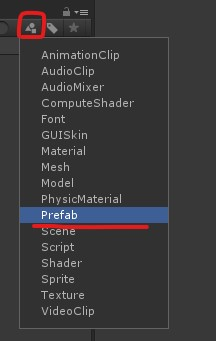
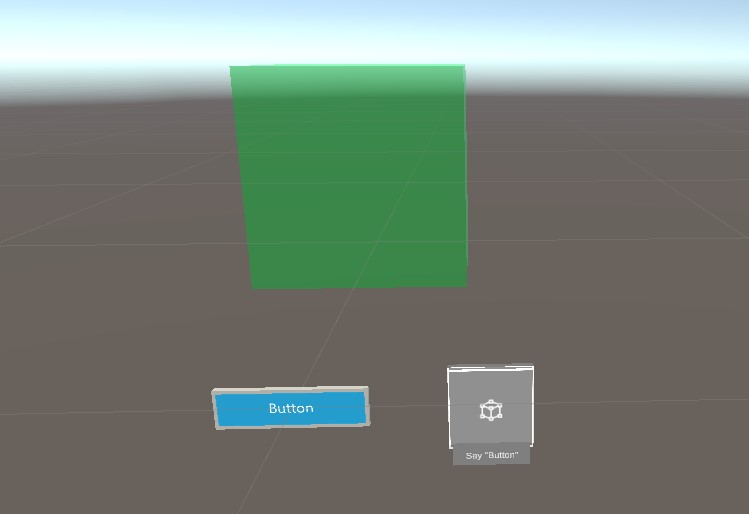

# Task 2 - Mixed Reality Toolkit Features

## ✏️ Create a new scene and add parent object

Let's try out some of the buttons from the Mixed Reality toolkit.

First create a new Scene called `Buttons`.

Add a new empty GameObject called `Playspace`.

 Remember to check the parent position.

## ✏️ Add button prefabs

Next: filter the project pane by prefabs:

.

Find the `Button` and `HolographicButton` and drag them under the `Playspace` GameObject.

❗️ When asked to import `Text Mesh Pro` click `Import Text Mesh Pro essentials`.

The buttons are set up with the `Interactable` script which allows us to add events to it.

It also has a collider by default so that our cursor can focus the button.

## ✏️Create a cube
Create a new 3D GameObject of the type Cube under `Playspace`.

Place the objects so that they don't overlap and is placed in front of the camera. Verify this by using the Play mode. It might be a good idea to scale down the cube. It might look something like this: 

.

Find one of the materials provided in the Mixed Reality Toolkit and add it to the cube. 

ℹ️ You can filter the Project pane by `Materials`

## ✏️Create a script
Let's create a new script called buttons.

Inside it we need two functions: one to move the cube left or right (you can also write two functions to do this if you prefer that) and one to reset the cube position.

We will attach the script to the cube, so we can assume that when modifying the transform we don't need to think about targeting a GameObject.

Try it out! If you get stuck just ask, or check out the Unity documentation: [Unity docs](https://docs.unity3d.com/2018.3/Documentation/Manual/). 

One of the ways to solve this can be found here: https://github.com/grynag/MixedRealityDevelopmentDemos

[4 Deployment and testing](../4-Deployment-and-test/TASK1.md) :arrow_forward: