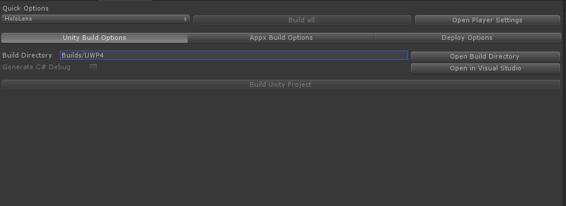
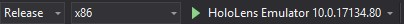
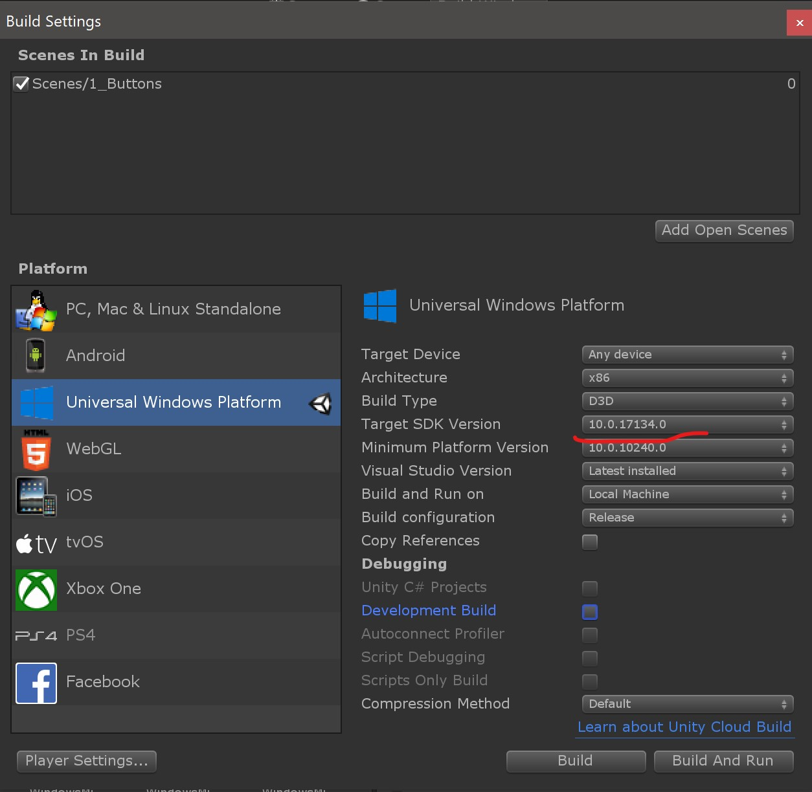

# Task 3 - Deploying to the HoloLens emulator

Hopefully we have set everything up right so that we can deploy our application to the HoloLens emulator. 

:pencil2: First go to **Mixed reality Toolkit -> Utilities -> Build window** in the Toolbar. This will open a new build panel for us. For me it opens at the same spot as the Scene panel.

Click **Build Unity Project**

When it is done, you will be prompted. Click **Ok**, then **Open in Visual Studio** from the Build panel. 

In Visual Studio change from **Debug** to **Release**, **ARM** to **x86** and set the build target to **HoloLensEmulator**. 

Click on the **HoloLensEmulator** to build and deploy to the emulator.

If all goes well your application should be deployed to the HoloLens emulator. 

:information_source: Even though the emulator might work fine for development I would recommend to build and test often on the HoloLens itself if you have one available. This will prevent you from spending time adjusting the GUI just to find that the sizing and positioning does not work in the HoloLens, or that some features that work in the emulator might not work on the device itself. 

:information_source: The build and deploy process will be the same for deploying to the HoloLens.

❗️ As of now if we want to build to the HoloLens 1 we need to set the Target SDK Version to 10.0.17134.0. We do this under **File -> Build settings**. If we want to build for the HoloeLens 2 we need [Windows 10 SDK (10.0.18362.0)](https://developer.microsoft.com/en-US/windows/downloads/windows-10-sdk) (can't be installe via Visual Studio yet).
   
