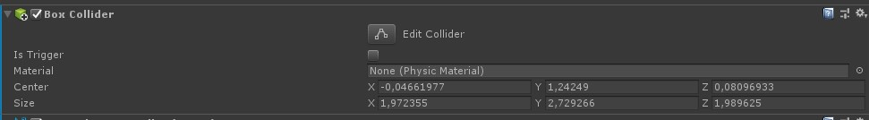
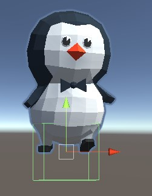
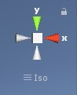
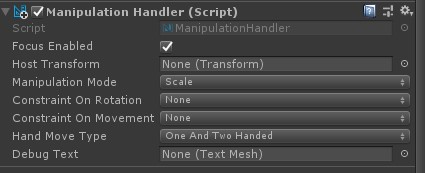
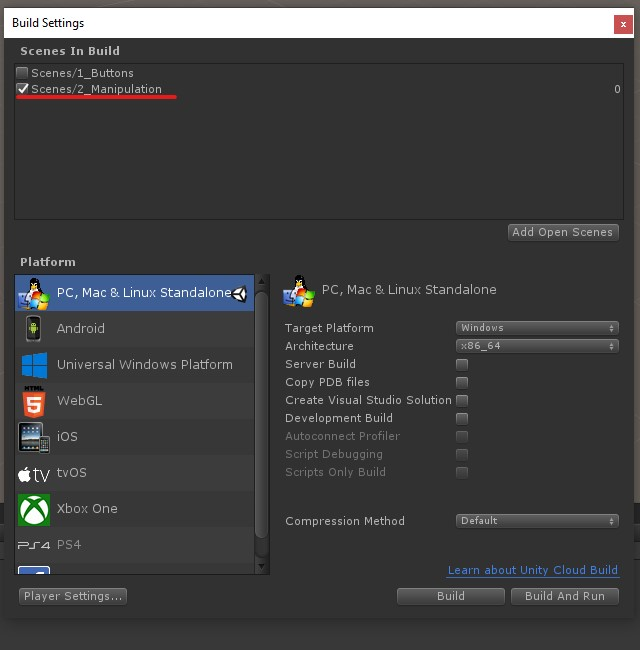

# Manipulation and Tooltips

MRTK docs: [Manipulation Handler](https://github.com/Microsoft/MixedRealityToolkit-Unity/blob/mrtk_release/Documentation/README_ManipulationHandler.md) and [Tooltip](https://github.com/Microsoft/MixedRealityToolkit-Unity/blob/mrtk_release/Documentation/README_Tooltip.md)

## ✏️ Create a new scene
Create a new scene called `2_Manipulation`

## ✏️ Adding a 3D-model
We start by adding a 3D model we can manipulate. In this case we will use Chester, the cute penguin, made by Claudelle Girard. You can download Chester :penguin: from the root folder of the repository (https://github.com/grynag/MixedRealityDevelopment/blob/master/Assets/chester.fbx). After downloading it, create a new folder in the Project Pane called `Assets` and add Chester to it.  

## ✏️ Create an empty object in the Hierarchy and call it *Playspace*
Add Chester as a child object. Move Chester so that he is visible in the camera (4 meters away is a good starting position).

## ✏️ Scale and add collider
To interact with Chester we need to add a collider to him. We do that by clicking on him in either the hierarchy or the scene panel and clicking *Add new component* in the inspector. Choose physic, and select *Box collider*. The box collider will be a lot smaller than Chester, so we need to adjust it. To do so click on *Edit collider* in the inspector:  

️️️ℹ️ If the inspector view is blank, click on Chester in the Hierarchy view. 

When you click on *Edit collider* a green square will appear in the Scene view. From here you can use the small squares to drag the collider and make it large enough (Chester should be inside it).     

To make the job easier, change the camera angle to see Chester from the front, the side and under or top.  

## ✏️ Add the *ManipulationHandler.cs*-script

Search for *ManipulationHandler* in the project panel and drag and drop it inside Chester's inspector window OR click on Chester and *Add component* in the Inspector panel and search for *ManipulationHandler*.

The manipulation handler has a set of properties we can change:  

Take a look through the different options. The MRTK takes care of the events for us and allows us to use the HoloLens gestures to manipulate the 3d-object. 

Set the **Hand Move Type** to `One handed only` and **Manipulation Mode** to `Scale`

## ✏️ Add a second chester with Two handed manipulation

Create a new folder called `Prefabs`. Drag Chester to the prefab folder. 

Drag the prefab into the `Playspace` so that you now have two copies of Chester. Place the two Chesters side by side. Change the **Hand Move Type** to `Two handed only` and **Manipulation Mode** to `Rotate Scale`.

ℹ️ You can change the name of the Prefab GameObjects to make it easier to remember who's who.

## ✏️ Add Tooltips

Search for **Simple line ToolTip** in the **Project view**. Drag it into the scene under **Scene content**. Under **Tool tip connector** in the inspector, add Chester's wingtip by pressing the small circle next to **target** and select one of the wingtips. Move the ToolTip to a "sensible" location. 

Under **Tool Tip Script -> Content settings** add text (ex. One hand) describing the manipulation mode. 

Repeat for the second Chester, this time with another tool tip text (ex. Two hands). Make sure that the wingtip you select belongs to the correct Chester (a line from the tool tip to the connected Chester should be visible in the scene). 

Build and deploy the application to either the HoloLens 1 or HoloLens 2 emulator. Now that we have two scenes in our project, only one of them will be started.

To build the new scene you need to add it to the in the **Files -> Builds settings**:   

❗️ Ask us if you want to test the application on the HoloLens (we have our version pre-built there).

One solution can be found here: 

[Move along ▶](TASK2.md)️