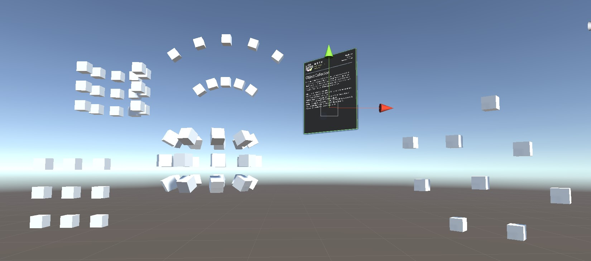

# Object Collection

MRTK docs: [Object Collection](https://github.com/Microsoft/MixedRealityToolkit-Unity/blob/mrtk_release/Documentation/README_ObjectCollection.md)

## ✏️ Create a new scene and parent components
Create a new scene in the scenes folder called `3_Collection`.

Add an empty GameObject called `Playspace`.

## ✏️ Create a prefab
Create a new GameObject called `Collection`. Add a 3D object of your choice underneath it. Give the cube one of the materials from the MRTK. 

Duplicate the cube (10 cubes is a good number). 

Drag the `Collection` to the prefabs folder.

## ✏️ Create a prefab
Add the `Scatter Object Collection`-script to the `Collection`. Try out the different settings. See the screenshot for inspiration.

Duplicate the collection and add the `Grid object collection` to it. 

⭐️ Add manipulation to the `Collection` prefab to enable scaling, moving or rotating the collections.  

[Move along ▶](TASK3.md)️