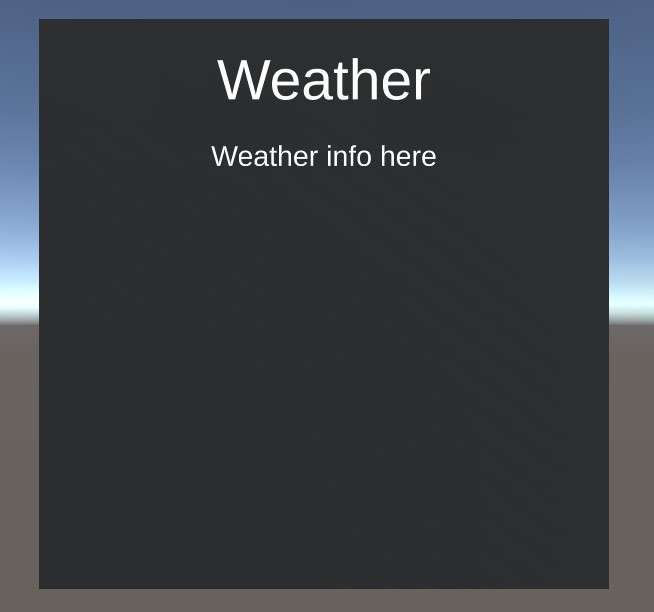
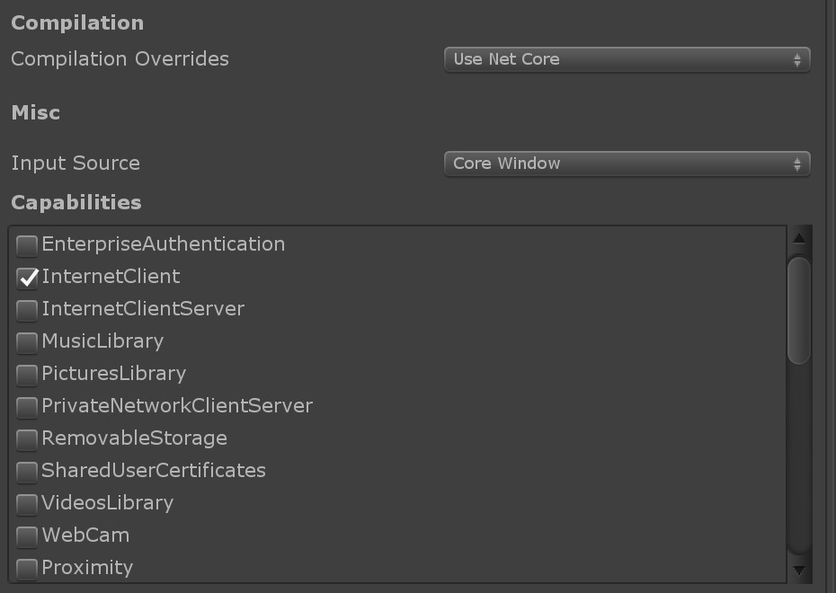

# Solver and API

MRTK docs: [System Keyboard](https://github.com/Microsoft/MixedRealityToolkit-Unity/blob/mrtk_release/Documentation/README_SystemKeyboard.md)

## ✏️ Create a new scene and parent components
Create a new scene in the scenes folder called `4_API`.

Add an empty GameObject called `Playspace`.

## ✏️ Create a pane
Create a new empty GameObject called `Weather` inside `Playspace`

Try to recreate this:   

Some pointers: cube, Text mesh pro and a MRTK material.

The title and the weather text should be two different components so we can change the text by script later. 

## ✏️ Add a solver
When creating a pane like this, we can make it turn toward the user as the user moves around, and stay inside the viewport. 

To do this we first add the `Solver Handler`-script to the `Menu`-GameObject. 

Next we add the `Radial view`-script. 

Test it in `Play mode` and tweak the settings until you think they are OK. I'd recommend trying to build this application and try it on the HoloLens at a later stage, to see if the pane works as you think it would while testing in Play mode. 

## ✏️ Acces the internet
We need to give our application access to the Internet. We do that by going to **Project settings -> Player** and checking the `InternetClient` under **Capabilities**

## ✏️ Get data from API
We are going to use [https://openweathermap.org/](https://openweathermap.org/)s API to get weather data. 

First you need to get an API-key. See the instructions here: [https://openweathermap.org/appid#get](https://openweathermap.org/appid#get).

Create a new script called `WeatherData` and use the [UnityEngine.Networking](https://docs.unity3d.com/2018.3/Documentation/ScriptReference/Networking.UnityWebRequest.html) to make a request to openweathermap.org to get the data. 

The request URL will look like this: `https://api.openweathermap.org/data/2.5/weather?q=Stavanger&units=metric&appid={YOURAPIKEY}`

Next create a new folder called `Plugins`. Create a script called `SimpleJSON` inside it and add the content from [here](https://github.com/Bunny83/SimpleJSON/blob/master/SimpleJSON.cs). 

Use SimpleJSON to parse the JSON response and print the Location, weather description and temperature to the weather info text you added earlier. You can find the SimleJSON docs here: [https://wiki.unity3d.com/index.php/SimpleJSON](https://wiki.unity3d.com/index.php/SimpleJSON)

## ✏️ Allow the user to search
The MRTK has a [keyboard](https://github.com/Microsoft/MixedRealityToolkit-Unity/blob/mrtk_release/Documentation/README_SystemKeyboard.md) we can use to get input from the user. 

Add the keyboard to an on click function (either a custom element or use a button).

If you have previously added the api call to the onStart function, move it so we can also run it on a button.

Add the users keyboard input to the URL.

Create a search button so that the user can run the function you created.

Build the application as AppX and try it on the HoloLens. 

## ⭐️ ✏️ Show the weather by using 3D models
Add 3D models to show what weather it is. A good source for simple 3D models is [poly.google.com](https://poly.google.com/).